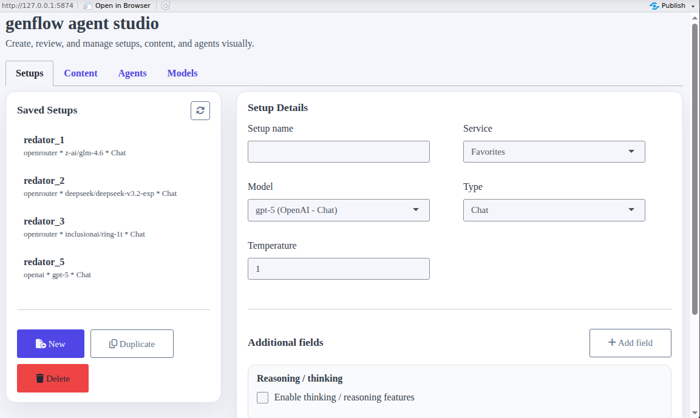
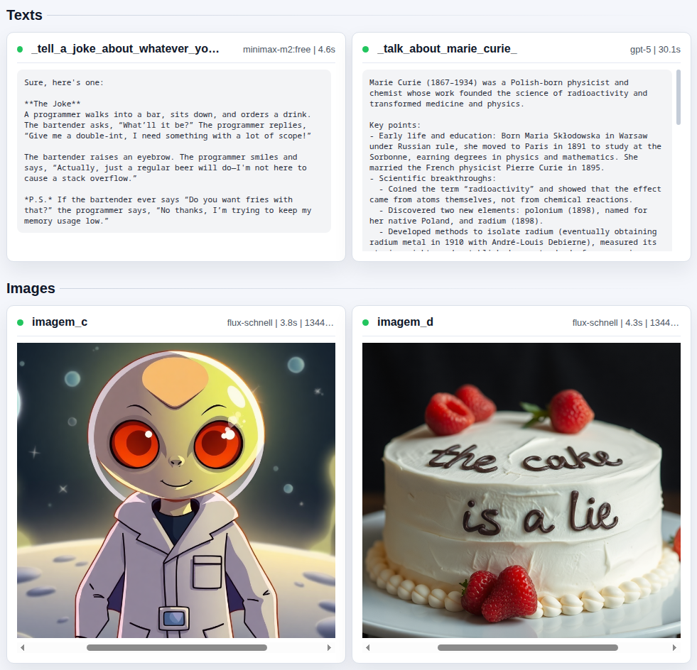
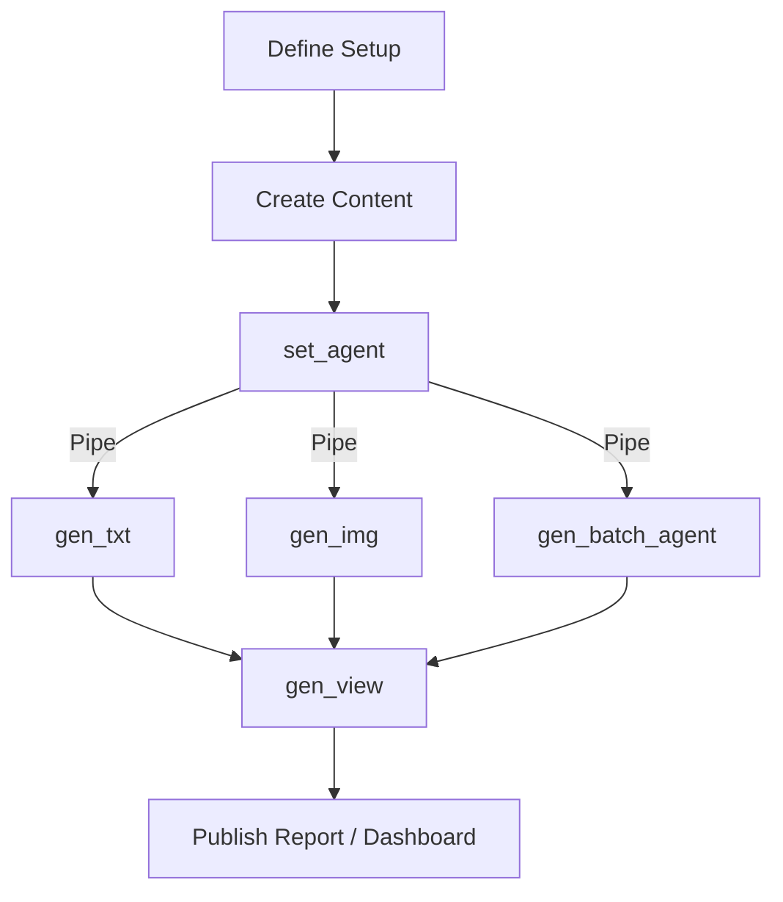

# 🌊 genflow - AI Generation Toolkit for R

[](https://www.repostatus.org/#active)
[](https://lifecycle.r-lib.org/articles/stages.html#experimental)
[](https://www.r-project.org/)
[](https://www.gnu.org/licenses/gpl-3.0)
<!-- badges: end -->

> **Easy generative AI inference for R**: genflow transforms your R workflows with seamless integration to the world's most powerful AI models. Generate text, images, and multimedia with unparalleled ease.

Dive into AI-powered R programming with **genflow** — an intuitive, powerful toolkit that connects R with leading AI providers including OpenAI, OpenRouter, Anthropic, Groq, Cerebras, Together, SambaNova, Nebius, DeepSeek, Perplexity, Fireworks, DeepInfra, Hyperbolic, Hugging Face, Replicate, and FAL, and now supports **local inference** with **Ollama** and **llama-cpp**.

## ✨ Why genflow?

- 🚀 **Fast Integration**: Connect to multiple AI providers in seconds, not hours
- 🎯 **Intentional Design**: Built specifically for R workflows and data science pipelines
- 🌐 **Popular Provider Support**: OpenAI, OpenRouter, Anthropic, Groq, Cerebras, Together, SambaNova, Nebius, DeepSeek, Perplexity, Fireworks, DeepInfra, Hyperbolic, Hugging Face, Replicate, FAL, and more
- 🏠 **Local AI Mode**: Run `gen_txt()` against Ollama and llama-cpp on your own machine
- 📝 **Multi-Modal Inference**: Text generation, image creation, audio processing, and beyond
- ⚡ **Optimized Performance**: Batch processing and parallel execution for faster tasks
- 📊 **Smart Analytics**: Built-in tracking, logging, and performance metrics
- 🔄 **Easy Model Updates**: Automatic model discovery and management
- 👁️ **Integrated Viewer**: Built-in visualization for all generated content
- 🧠 **Reusable Agents**: Define setups, content, and agents once, then reuse them across sessions with a single pipe

## 🚀 Getting Started

### Installation

```r
# Install the development version from GitHub
# install.packages("devtools")
devtools::install_github("hugorteixeira/genflow")
```

### Setup Provider Credentials (Cloud + Local)

Configure your provider credentials in your `.Renviron` file:

```r
# Add to your .Renviron file
OPENAI_API_KEY=your_openai_api_key_here
OPENAI_MODEL=gpt-5-mini

# Local provider: Ollama
OLLAMA_BASE_URL=http://127.0.0.1:11434
OLLAMA_MODEL=llama3.2

# Local provider: llama-cpp
LLAMACPP_BASE_URL=http://127.0.0.1:8080
LLAMACPP_MODEL=optional-local-model
LLAMACPP_API_KEY=optional_token_here
```

You can edit your `.Renviron` file by running:

```r
usethis::edit_r_environ()
```

After adding your keys, restart your R session for the changes to take effect.

### Setup OpenAI-compatible Providers (Optional)

You can configure custom OpenAI-compatible providers directly in the RStudio
addin.

In the `genflow` addin, the **Models** tab now includes a **Custom providers**
panel where you can add, edit, remove, and test OpenAI-compatible providers
(including a live connection/model-list check).

## 💡 Examples

### Text Generation

```r
library(genflow)

# Transform complex concepts into clear explanations
result <- gen_txt(
  context = "Explain quantum computing like I'm dumb as a potato",
  service = "openai",
  model = "gpt-5",
  reasoning = "high"
)

# Instantly visualize your results
gen_view(result)
```

### Text Generation (Local Inference: Ollama or llama-cpp)

```r
library(genflow)

# Ollama
local_ollama <- gen_txt(
  context = "Tell me a ultra nasty joke to irritate the most people possible.",
  service = "ollama",
  model = "llama3.2"
)

# llama-cpp - accepts "llamacpp", "llama-cpp", or "llama_cpp"
local_llamacpp <- gen_txt(
  context = "Rewrite this as if you are Ricky Gervais in a stand-up.",
  service = "llamacpp",
  model = "local-model"
)

gen_view(local_ollama, local_llamacpp)
```

Both local providers are supported for local inference workflows.

### Image Generation

```r
# Bring your ideas to visual life
image_result <- gen_img(
  prompt = "An image of existence if existence didn't exist and even thinking about existence would make it exist.",
  service = "hf",  # Hugging Face
  model = "black-forest-labs/FLUX.1-schnell",
  h = 1024,
  y = 1024
)

# View your generated masterpiece
gen_view(image_result)
```


### Speech To Text

```r
# Transcribe an audio file (requires provider API key)
stt <- gen_stt(
  audio = "audio.ogg",
  service = "replicate",
  model = "openai/whisper"
)

stt$response_value
```

### Text To Speech

```r
# Synthesize speech from text (requires provider API key)
tts <- gen_tts(
  text = "Welcome to genflow.",
  service = "replicate",
  model = "qwen/qwen3-tts",
  voice = "Aiden"
)

tts$response_value
```

Tested model: `qwen/qwen3-tts` via Replicate. Other services/models are not tested yet.

### Reusable Agents & Content

```r
# Capture a reusable setup
set_setup(
  sname   = "writer_openai",
  service = "openai",
  model   = "gpt-4o-mini",
  temp    = 0.7,
  type    = "Chat"
)

# Store supporting content
set_content(
  cname   = "launch_brief",
  context = "We are launching an AI-first analytics tool.",
  add     = "Audience: crazy data people who are in a serious relationship with R.",
  label   = "launch_announcement"
)

# Combine into an agent (automatically cached on disk)
creative_agent <- set_agent(
  name    = "creative_writer",
  setup   = "writer_openai",
  content = "launch_brief"
)

# Pipe agents directly into generators
creative_agent |> gen_txt()
creative_agent |> gen_img(prompt = "Richard Feynman and Michael Jackson playing Final Fantasy IX")

# Inspect everything that is cached
gen_list()
```

Agents, setups, and content are stored under `options("genflow.cache_dir")`
(defaults to `tools::R_user_dir("genflow", "cache")`), so they survive across R
sessions. A simple `get_agent("creative_writer")` in a future session gives you
a ready-to-use list that pipes straight into any generator.

Need an interface? Launch the interactive agent manager anytime with:

```r
gen_interface()

```




You’ll also find a “Launch Genflow Agent Interface” entry under the RStudio Addins menu for one-click access.

### Easy Object Visualization



### Batch Processing

```r
# Load or build an agent
agent <- get_agent("creative_writer")

# Optional per-item data
one_item_each <- list(
  list(topic = "Healthcare Price Markupper", tone = "optimistic"),
  list(topic = "Retail Master of Boredom", tone = "boring"),
  list(topic = "Financial Fortune Teller", tone = "cynical")
)

# Run a batch in parallel – temporary agents are created and cleaned up automatically
results <- agent |> gen_batch_agent(
  qty = 3,
  instructions = "Write a 120-word launch announcement of a atomic bomb made of gummy bears.",
  one_item_each = one_item_each,
  directory = "generated_content"
)

gen_view(results)
```

### Intelligent Model Management

```r
# Stay current with the latest models
gen_update_models()

# Discover the perfect model for your task
gen_show_models(provider = "openai", type = "chat")
```


## 🧭 Example Workflow (Mermaid)



> _GitHub renders this Mermaid diagram automatically once committed. For local previews without Mermaid support, paste the snippet into [mermaid.live](https://mermaid.live/)._

## 🔧 Complete Function Reference

| Function | Purpose |
|---------|-------------|
| `gen_txt()` | Generate text with cloud and local providers (including **Ollama** and **llama-cpp**) |
| `gen_img()` | Create stunning images from text prompts |
| `gen_stt()` | Speech-to-text (tested: Replicate `openai/whisper`; other services/models not tested yet) |
| `gen_tts()` | Text-to-speech (tested: Replicate `qwen/qwen3-tts`; other services/models not tested yet) |
| `gen_batch()` | Execute parallel generation campaigns |
| `gen_view()` | Visualize and explore generation results |
| `gen_stats()` | Analyze performance and usage metrics |
| `gen_stats_rm()` | Clean and manage statistics data |
| `gen_update_models()` | Refresh available models from supported providers (including local catalogs) |
| `gen_show_models()` | Browse and filter available models |
| `set_setup()` / `get_setup()` / `list_setups()` | Persist provider configurations for reuse |
| `set_content()` / `get_content()` / `list_content()` | Store briefs, context, and other payloads |
| `set_agent()` / `get_agent()` / `list_agents()` | Combine setups and content into reusable agents |
| `mv_*()` / `rm_*()` | Rename or delete cached setups, content, or agents |
| `gen_list()` | Summarize everything saved in the cache directory |
| `gen_batch_agent()` | Run batch workloads directly from a `genflow_agent` |
| `gen_interface()` | Launch the interactive agent management interface (also available as an RStudio addin) |

## 📊 Workflow Integration

genflow is designed to seamlessly integrate into your existing R workflows:

```r
# Pull an agent and pass it straight into generators & pipelines
agent <- get_agent("creative_writer")

# Generate both narrative and visuals for your reports
copy <- agent |> gen_txt()
visual <- agent |> gen_img(prompt = "Millions of rubber ducks blitzkrieging Geneva")

# Feed generated assets into downstream analysis, dashboards, and reports
```

## 🛡️ Best Practices

### Production Readiness

- ⚡ **Monitor Usage**: Track API consumption with built-in statistics
- 🔐 **Secure Keys**: Keep API keys in environment variables, never in code
- 🧪 **Test Thoroughly**: Validate outputs for your specific use cases
- 📈 **Scale Smart**: Use batch processing for high-volume tasks

### Performance Tips

- 🔁 **Reuse Connections**: Initialize once, generate many
- 📦 **Manage Memory**: Use `gen_stats_rm()` to clean up old data
- ⚡ **Choose Wisely**: Select the right model for your specific task
- 🔄 **Update Regularly**: Run `gen_update_models()` periodically

## 🤝 Contributing

We welcome contributions! Whether it's:
- 🐛 Bug reports and fixes
- ✨ New feature proposals
- 📝 Documentation improvements
- 🎯 Performance optimizations

## 📄 License

This project is licensed under the GPL-3 License.

## 🙏 Acknowledgments

Special thanks to the AI provider communities and the R ecosystem for making genflow possible.

## 👨‍💻 About the Author

Hi, I'm Hugo. I build tools around trading, backtesting, and generative models in R to iterate on strategies faster and create cool stuff. If you find genflow useful (or want to suggest improvements!), feedback is always welcome.

---

Project Link: [https://github.com/hugorteixeira/genflow](https://github.com/hugorteixeira/genflow)

---

<p align="center">Flow into the future of AI with ❤️ and ☕ in R</p>
