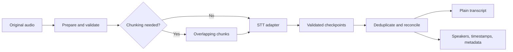

# 🌊 genflow — AI Generation Toolkit for R

[](https://lifecycle.r-lib.org/articles/stages.html#experimental)
[](https://www.r-project.org/)
[](https://www.gnu.org/licenses/gpl-3.0)

> **Easy generative AI workflows for R.** Generate text, images, transcripts,
> and speech with cloud APIs or local models — through one consistent interface.

**genflow** connects R to OpenAI, OpenRouter, Gemini, Hugging Face, Replicate,
FAL, Ollama, llama.cpp, native speech engines, and custom OpenAI-compatible
servers. It also gives you reusable agents, parallel batches, model catalogs,
structured results, and a Shiny/RStudio management app.

<p align="center">
  <a href="#-getting-started">Getting started</a> ·
  <a href="#-everyday-examples">Examples</a> ·
  <a href="#-asr-for-real-world-recordings">ASR</a> ·
  <a href="#-reusable-agents">Agents</a> ·
  <a href="#-function-reference">Reference</a>
</p>

## ✨ Why genflow?

- 🚀 **One interface:** a shared result contract across text, image, STT, and TTS
- 🌐 **Cloud and local:** switch providers without rebuilding your R workflow
- 🎙️ **Serious ASR:** long-audio chunking, resume, retries, diarization, and
  cross-chunk speaker continuity
- 🧠 **Reusable agents:** save setups and content, then pipe them into generators
- ⚡ **Parallel batches:** separate task count from worker concurrency and
  checkpoint individual results
- 🔄 **Model catalogs:** discover cloud models and manage downloaded native
  speech models
- 👁️ **Built-in viewer:** inspect generated text and media without leaving R
- 🖥️ **Interactive app:** manage credentials, models, local runtimes, and agents

| Create | Function | Typical use |
|:--:|---|---|
| ✍️ | `gen_txt()` | Text, reasoning, vision, and tool-aware prompts |
| 🖼️ | `gen_img()` | Image generation from text prompts |
| 🎙️ | `gen_stt()` | Cloud or local speech-to-text |
| 🔊 | `gen_tts()` | Speech synthesis |

## 🚀 Getting Started

### Installation

```r
# install.packages("pak")
pak::pak("hugorteixeira/genflow")
```

### Your first call

Keep cloud credentials in environment variables rather than scripts. The app
can add, import, or remove supported keys from your user `.Renviron`:

```r
library(genflow)
gen_interface()
```

Open **Models > Credentials**, save the key, refresh that provider's catalog,
and select a model in a setup or agent.

<details>
<summary><strong>Prefer to configure credentials manually?</strong></summary>

```text
OPENAI_API_KEY=...
GOOGLE_API_KEY=...       # GEMINI_API_KEY is also accepted
HUGGINGFACE_API_TOKEN=...
REPLICATE_API_TOKEN=...
FAL_KEY=...
```

Use `usethis::edit_r_environ()`, then restart R or reload the file with
`readRenviron("~/.Renviron")`. Secrets are not stored in agents, catalogs,
local-inference settings, or exported bundles.

</details>

Generate text and inspect the normalized result:

```r
result <- gen_txt(
  context = "Explain why reproducible backtests need point-in-time data.",
  service = "openai",
  model = "gpt-5-mini",
  reasoning = "medium"
)

result$status_api
result$response_value
```

Every high-level generator returns a list with `response_value`, `service`,
`model`, `duration`, `status_api`, and `status_msg`. Text adds token estimates;
successful media calls add saved-file information.

Generated files default to `~/.genflow`. Change the root globally with:

```r
options(genflow.output_dir = "/absolute/path/to/genflow-output")
```

## 💡 Everyday Examples

### Local text with Ollama or llama.cpp

```r
ollama_result <- gen_txt(
  "Summarize this release note in five bullets.",
  service = "ollama",
  model = "llama3.2"
)

llamacpp_result <- gen_txt(
  "Draft a concise incident report.",
  service = "llamacpp",
  model = "local-model"
)
```

The default endpoints are `http://127.0.0.1:11434` for Ollama and
`http://127.0.0.1:8080` for llama.cpp. genflow talks to these servers; it does
not install or supervise them.

### Image generation

```r
image_result <- gen_img(
  prompt = "A clean isometric diagram of a reproducible data pipeline",
  service = "openai",
  model = "gpt-image-2",
  h = 1024,
  y = 1024
)

gen_view(image_result)
```

### Cloud speech-to-text

```r
transcript <- gen_stt(
  "interview.ogg",
  service = "openai",
  model = "whisper-1"
)

transcript$response_value
```

### Text-to-speech

```r
speech <- gen_tts(
  "The validation run completed successfully.",
  service = "openai",
  model = "gpt-4o-mini-tts",
  voice = "alloy"
)
```

## 🎙️ ASR for real-world recordings

The newest ASR work makes `gen_stt()` an **audio orchestrator**, not just an API
wrapper. Give it the original recording; genflow can prepare it, split it only
when needed, resume completed parts, retry transient failures, remove overlap,
reconcile speaker identities, and return one auditable result.

### Choose where transcription runs

| Path | `service` | Best for |
|---|---|---|
| ☁️ Managed API | `openai`, `groq`, `assemblyai`, `cloudflare`, `voicegain`, `hf`, `replicate` | Minimal local setup |
| 🏠 Native CLI | `local-native` | GGUF speech models through CrispASR or moss-transcribe.cpp |
| 🔌 Your server | `local-openai` | Any server implementing the OpenAI multipart transcription contract |

### Native ASR quick start

Configure a compiled native engine once, diagnose it, and then select a
compatible downloaded model:

```r
gen_local_config(
  stt_native_engine = "crispasr",
  stt_native_crispasr_executable =
    "/absolute/path/to/CrispASR/build-vulkan/bin/crispasr",
  stt_native_device = "vulkan"
)

gen_local_diagnostics(
  adapters = "local-native",
  check_endpoints = FALSE
)

native_result <- gen_stt(
  "meeting.wav",
  service = "local-native",
  model = "granite-speech-4.1-2b-q4_k.gguf",
  timeout_api = 1800
)
```

The app keeps the CrispASR and moss-transcribe.cpp executable paths separately
under **Local > Native STT**, so switching engines does not erase either setup.
Model compatibility is owned by the selected engine; a GGUF file is not
automatically compatible just because it came from Hugging Face.

### Long audio, speakers, and resumable work

This is the complete durable path for a long, multi-speaker recording:

```r
meeting <- gen_stt(
  "meeting.wav",
  service = "local-native",
  model = "moss-transcribe-diarize-0.9b-q8_0.gguf",
  native_engine = "crispasr",
  diarize = TRUE,
  timestamps = TRUE,
  chunking = "auto",
  chunk_format = "mp3",
  chunk_overlap_seconds = 8,
  checkpoint_dir = "meeting-stt-work",
  checkpoint_retention = "results",
  output = "transcript",
  timeout_api = 1800
)

meeting$response_value
meeting$diarized_transcript
meeting$saved_metadata_file
meeting$metadata$chunking
meeting$metadata$reconciliation
```

`output = "transcript"` is still a structured result — never a character
shortcut. It keeps the common runtime fields plus normalized transcript,
segments, diarization, chunking, and reconciliation metadata.


```mermaid
flowchart LR
  A[Original audio] --> B[Prepare and validate]
  B --> C{Chunking needed?}
  C -->|No| D[STT adapter]
  C -->|Yes| E[Overlapping chunks]
  E --> D
  D --> F[Validated checkpoints]
  F --> G[Deduplicate and reconcile]
  G --> H[Plain transcript]
  G --> I[Speakers, timestamps, metadata]
```

#### Speaker-aware output

Models with native speaker metadata expose readable turns through
`diarized_transcript` while preserving the plain text in `response_value`.
Public labels are normalized to `S01`, `S02`, and so on. With
`save_txt = TRUE`, a JSON sidecar in `saved_metadata_file` preserves the
structured transcript and audit metadata.

For models without native labels, CrispASR can add its generic
Pyannote + TitaNet pipeline without Python:

```r
speaker_result <- gen_stt(
  "roundtable.wav",
  service = "local-native",
  model = "cohere-transcribe-q8_0.gguf",
  diarize = TRUE,
  diarize_speakers = TRUE,
  diarize_embedder = TRUE
)

speaker_result$diarized_transcript
```

Set `diarize_embedder = FALSE` to skip the CPU-heavy clustering pass. That is
faster, but speaker numbers become best-effort and may swap during a long
recording.

<details>
<summary><strong>What the long-audio pipeline guarantees</strong></summary>

- **Adaptive preparation:** `chunking = "auto"` combines your limits with
  adapter transport limits and documented model limits. Segment duration can
  shrink when encoded bytes still exceed the effective ceiling.
- **Safe resume:** persistent checkpoints are validated against the source,
  effective configuration, model/executable signature, size, duration, and
  chunk fingerprint before reuse.
- **Bounded ownership:** one run has one writer. Stale locks are recovered
  conservatively, and cleanup is limited to Genflow-owned files for that source.
- **Useful retention:** `checkpoint_retention = "results"` removes prepared
  chunk audio only after final success, while retaining manifests and completed
  per-part transcript checkpoints.
- **Conservative stitching:** only exact normalized text overlap can delete
  duplicated content. Speaker mappings require strong overlap evidence;
  ambiguous identities remain unresolved in metadata instead of being guessed.
- **Global output:** chunk timestamps become recording timestamps, and public
  speaker labels are dense and stable by first appearance in the merged result.

Checkpoint folders contain prepared audio and transcript data. Treat them as
sensitive and budget their disk usage accordingly.

</details>

<details>
<summary><strong>Formats, limits, and native model notes</strong></summary>

- `chunk_format = "auto"` uses PCM mono 16 kHz WAV for native calls and compact
  mono 16 kHz MP3 for remote calls. CrispASR also accepts explicit MP3;
  moss-transcribe.cpp requires WAV.
- Automatic MOSS Diarize chunking uses conservative model-safe windows for
  recordings over 60 minutes. `chunking = "never"` explicitly accepts the
  whole-file truncation or context risk.
- MOSS Diarize defaults its CrispASR KV cache to `q8_0`. Explicit `f16`,
  `q8_0`, or `q4_0` wins; `q4_0` is supported but not recommended because
  degraded output has been observed.
- The default timeout grows with audio duration. Use
  `timeout_per_audio_minute = 0` only when you intentionally want a fixed
  timeout.
- `gen_stt_capabilities()` exposes adapter-owned input constraints, while
  `gen_stt_signature()` gives downstream caches a secret-free fingerprint of
  the effective STT configuration.

</details>

For the full runtime precedence, model-download workflow, Vulkan notes, and
security boundaries, see [Local inference](inst/doc/local-inference.md). The
complete argument and return contract lives in [`gen_stt()`](man/gen_stt.Rd).

## 🧠 Reusable Agents

Save provider settings and content once, then pipe the resulting agent into
generators:

```r
set_setup(
  sname = "reviewer",
  service = "openai",
  model = "gpt-5-mini",
  reasoning = "medium",
  type = "Chat"
)

set_content(
  cname = "release_notes",
  context = "Review these release notes for ambiguity and missing risks."
)

agent <- set_agent(
  name = "release_reviewer",
  setup = "reviewer",
  content = "release_notes"
)

agent |> gen_txt()
agent |> gen_img(prompt_override = "A minimal release dashboard")
```

Setups, content, and agents persist below
`tools::R_user_dir("genflow", "cache")` and survive across R sessions.

Launch the manager from R or the **Launch Genflow Agent Interface** RStudio
addin:

```r
gen_interface()
```

<p align="center">
  
</p>

## 👁️ Easy Object Visualization

Pass one or many structured results to `gen_view()`:

```r
gen_view(result, image_result, transcript)
```

<p align="center">
  
</p>

## ⚡ Parallel Batches

```r
agent <- get_agent("release_reviewer")

results <- agent |> gen_batch_agent(
  qty = 12,
  instructions = "Write a concise release announcement.",
  workers = 3,
  persist = FALSE
)

gen_view(results)
```

`qty` is the number of tasks; `workers` is the concurrency ceiling. The default
PSOCK backend is safe for provider networking on every operating system. Use
`checkpoint_each` for one atomic RDS checkpoint per task when a caller needs
durable partial progress.

## 🔄 Models and Local Runtimes

```r
gen_update_models(
  provider = c("openai", "hf", "local-native"),
  fail_on_error = TRUE
)

gen_show_models(provider = "hf", type = "Chat")
gen_show_models(provider = "local-native", type = "Audio")
```

Remote Hugging Face inference (`hf`) and downloaded native audio models
(`local-native`) are intentionally separate catalogs. In the app, use
**Models** to choose provider/model pairs and **Local** to configure or diagnose
the runtime that executes them.

## 🔧 Function Reference

| Function | Purpose |
|---|---|
| `gen_txt()` | Generate text with cloud and local providers |
| `gen_img()` | Generate images from prompts |
| `gen_stt()` | Transcribe audio with cloud, native, or local-server adapters |
| `gen_stt_capabilities()` | Inspect adapter-owned audio limits |
| `gen_stt_signature()` | Fingerprint the effective secret-free STT configuration |
| `gen_tts()` / `gen_tts_voices()` | Synthesize speech and inspect supported voices |
| `gen_batch()` / `gen_batch_agent()` | Run parallel, checkpointable workloads |
| `set_*()` / `get_*()` / `list_*()` | Persist setups, content, agents, and providers |
| `gen_local_config()` | Read or update non-secret local runtime settings |
| `gen_local_diagnostics()` | Check native executables, devices, and endpoints |
| `gen_update_models()` / `gen_show_models()` | Refresh and browse model catalogs |
| `gen_interface()` | Launch the interactive management app |
| `gen_view()` | View structured generation results |
| `gen_stats()` / `gen_stats_rm()` | Inspect or remove daily usage logs |
| `gen_export_bundle()` / `gen_import_bundle()` | Move validated portable bundles |
| `gen_vote()` | Extract and rank structured vote markers |

See [Architecture and runtime contract](inst/doc/architecture-and-runtime-contract.md)
for provider boundaries, persistence rules, and the integration checklist.

## 🛡️ Best Practices

- 🔐 Keep API keys in environment variables, never in agents or source code.
- 🧪 Pin important models and smoke-test the exact provider path you deploy.
- 📦 Use persistent checkpoints for expensive ASR and batch workloads.
- 📊 Inspect `status_api` and `status_msg` instead of assuming a returned object
  means success.
- 🧹 Protect transcript/checkpoint directories and remove sensitive artifacts
  according to your own retention policy.

genflow is experimental. Provider APIs, model schemas, and local engines can
change independently, so production workflows should validate the exact
versions they use.

## 🤝 Contributing

Bug reports, focused fixes, documentation improvements, and provider
integrations are welcome. Please include a reproducible example and avoid real
credentials or sensitive transcripts.

## 📄 License

GPL (>= 3), as declared in [DESCRIPTION](DESCRIPTION).

## 👨‍💻 About the Author

Hi, I'm Hugo. I build tools around trading, backtesting, and generative models
in R to iterate faster and create cool stuff. Feedback and ideas are always
welcome.

---

Project: [github.com/hugorteixeira/genflow](https://github.com/hugorteixeira/genflow)

<p align="center">Flow into the future of AI with ❤️ and ☕ in R</p>
